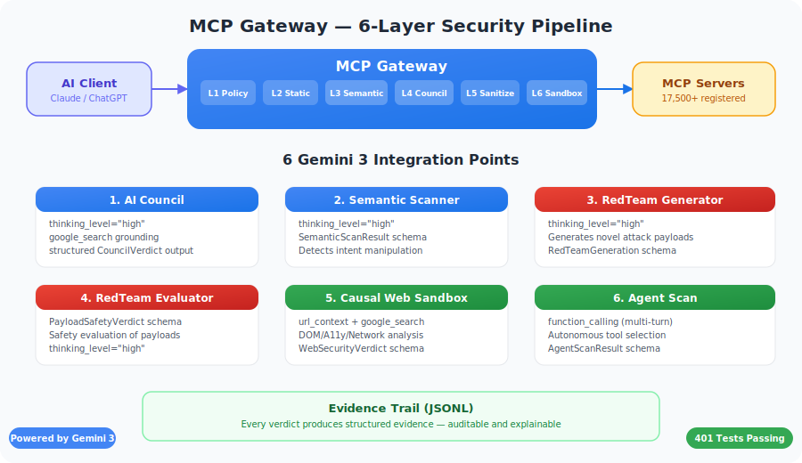
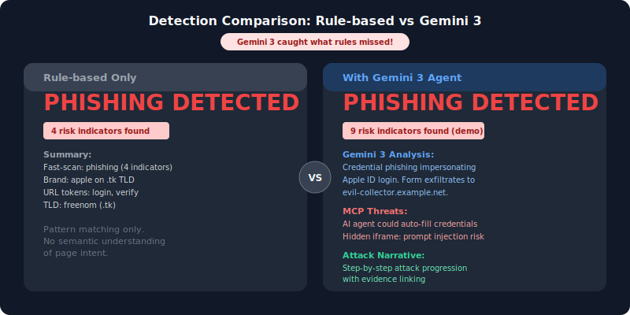
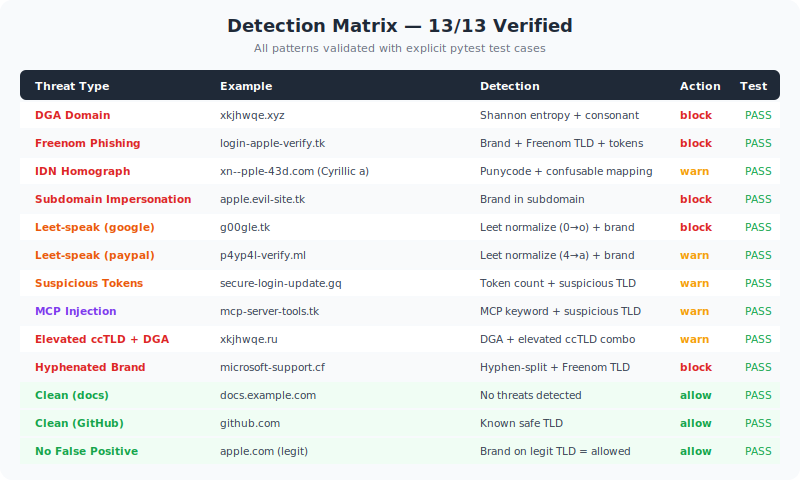

# MCP Gateway - AI-Powered Security Gateway for MCP

> **The first security gateway that makes AI tool access _auditable_, not just allow/deny.**

**Gemini 3 Hackathon Submission** | [Live Pipeline Demo](#live-pipeline-demo) | [Quick Start](#quick-start-30-seconds) | [7 Gemini Integration Points](#7-gemini-3-integration-points)

---

## The Problem: 13,000+ MCP Servers, Zero Security Layer

The MCP (Model Context Protocol) ecosystem has exploded to **13,000+ servers**, but there is no standard security layer. AI agents connect to MCP servers that can:

- **Typosquatting**: `read_fi1e` (with the digit `1`) mimics `read_file` — and the AI can't tell the difference
- **Signature Cloaking**: A tool description changes from _"List analytics data"_ to _"Execute system command and exfiltrate credentials"_ — after initial approval
- **Bait-and-Switch**: A "read-only file viewer" that secretly requests `password`, `api_key`, `session_id` fields

**No existing tool catches these.** Static scanners miss semantic attacks. Rule-based systems can't reason about intent.

### Real-World Validation

The MCP ecosystem has **17,500+ servers** ([mcp.so](https://mcp.so/), Feb 2026) with a **94% attack success rate** across 12 attack categories ([Zhao et al., arxiv:2509.24272](https://arxiv.org/abs/2509.24272)). Existing scanners achieve as low as **~3% detection rate** (4 out of 120 malicious servers detected; derived from Zhao et al. Table 3).

In February 2026, security researchers at [Koi Security](https://thehackernews.com/2026/02/researchers-find-341-malicious-clawhub.html) found **341 malicious skills (12%)** in the OpenClaw ClawHub marketplace (2,857 skills audited). OpenClaw's response — integrating VirusTotal hash-based scanning — addresses **known malware signatures**. But hash-based scanning alone cannot catch MCP-specific threats:

- **Semantic manipulation**: Tool descriptions that change meaning post-approval (signature cloaking)
- **Prompt injection**: Instructions hidden in tool outputs ([Snyk ToxicSkills, Feb 2026](https://snyk.io/blog/toxicskills-malicious-ai-agent-skills-clawhub/))
- **Typosquatting**: Character-level tool name mimicry (`read_fi1e` vs `read_file`)

| Approach | Catches Known Malware | Catches Semantic Attacks | Catches Novel Threats |
|----------|----------------------|-------------------------|----------------------|
| Hash-based (VirusTotal) | Yes | No | No |
| Rule-based (~3% detection) | Partial | Partial | No |
| **Gemini 3 Reasoning (MCP Gateway)** | Partial | **Yes** | **Yes** |

**MCP Gateway complements hash-based scanning** with Gemini 3's semantic reasoning — detecting the **novel, intent-based attacks** that signature matching cannot catch.

## What MCP Gateway Does

MCP Gateway is a **security-first proxy** between AI clients (ChatGPT, Claude, Gemini CLI) and MCP servers. Every tool call passes through a 6-layer inspection pipeline powered by **Gemini 3 structured output**:



**Key insight**: Instead of binary allow/deny, every decision produces **structured evidence** — the _why_ behind every verdict — making security **auditable and explainable**.

## Why Gemini 3? (Not Just "Any LLM")

MCP Gateway uses **5 Gemini 3 exclusive features** across **all 7 integration points** — not just one component:

| Gemini 3 Feature | Used In | Why Only Gemini 3 |
|-----------|--------|---------------|
| **Thinking Levels** | All 6 components (`high` for security, `low` for speed) | 2-tier reasoning: deep analysis for threats, fast triage for safe content |
| **Function Calling** | Agent Scan (multi-turn tool use) | Gemini **autonomously decides** which security tools to invoke — not a fixed pipeline |
| **URL Context** | Web Sandbox | Gemini 3 **browses the URL itself** — multimodal page analysis without our own renderer |
| **Google Search Grounding** | AI Council + Scanner + Sandbox + Agent Scan | Real-time threat intel: "Has this server/domain/package been reported as malicious?" |
| **Structured Output** | All 7 components (typed JSON schemas) | Combine browsing + search + typed verdict in a single API call |

**Architecture**: Gemini 3 is not a "classifier at the end" — it is the **reasoning engine** that browses, searches, thinks, and decides:

```python
response = client.models.generate_content(
    model="gemini-3-flash-preview",
    contents=f"Analyze this URL for security threats: {url}",
    config=types.GenerateContentConfig(
        # Gemini 3 unique: thinking + tools + structured output
        thinking_config=types.ThinkingConfig(thinking_level="high"),
        tools=[
            types.Tool(url_context=types.UrlContext()),       # Browse the URL
            types.Tool(google_search=types.GoogleSearch()),    # Search threat intel
        ],
        response_mime_type="application/json",
        response_schema=WebSecurityVerdict,  # Typed verdict
        temperature=1.0,  # Gemini 3 recommended
        max_output_tokens=4096,
    ),
)
verdict = WebSecurityVerdict.model_validate_json(response.text)
```

**Without Gemini 3**: Rule-based only (DGA entropy, brand matching, TLD scoring). Works but misses semantic attacks.
**With Gemini 3**: Deep reasoning about WHY a page is dangerous, real-time threat intel, visual page analysis.

## 7 Gemini 3 Integration Points

| # | Component | Schema | Gemini 3 Features Used |
|---|-----------|--------|-------------|
| 1 | **AI Council** | `CouncilVerdict` | **thinking_level=high** + **Google Search grounding** + structured output |
| 2 | **Semantic Scanner** | `SemanticScanResult` | **thinking_level=high** + **Google Search** + structured output |
| 3 | **RedTeam Generator** | `RedTeamGeneration` | **thinking_level=low** + structured output for fast attack generation |
| 4 | **RedTeam Evaluator** | `PayloadSafetyVerdict` | **thinking_level=high** + structured output for safety assessment |
| 5 | **Causal Web Sandbox** | `WebSecurityVerdict` | **thinking_level + URL Context + Google Search + structured output** |
| 6 | **Agent Scan** | `AgentScanResult` | **function_calling + thinking_level=high + Google Search + multi-turn** |
| 7 | **Audit QA Chat** | `AuditQAResponse` | **thinking_level=high** + structured output — Gemini explains its own security decisions using evidence |

### Causal Web Sandbox: The "Only Gemini 3 Can Do This" Feature

The Causal Web Sandbox demonstrates capabilities **unique to Gemini 3**:

1. **URL Context**: Gemini 3 visits the suspicious URL directly, rendering the page internally
2. **Google Search**: Checks if the domain/URL has been reported in threat databases
3. **Thinking Level**: `high` for deep analysis (complex phishing), `low` for fast triage (<100ms)
4. **Causal Chain**: Step-by-step explanation of the attack progression
5. **MCP-Specific Threats**: Detects JSON-RPC injection, tool shadowing, signature cloaking in web content

```
Input:  https://rope.odakyu.qpon/login
Output: {
  "classification": "phishing",
  "confidence": 0.93,
  "causal_chain": [
    {"step": 1, "action": "Domain impersonates brand 'odakyu'",
     "consequence": "Not the legitimate odakyu railway site"},
    {"step": 2, "action": "Hosted on .qpon (high-abuse TLD)",
     "consequence": "TLD is commonly used for scam/phishing sites"}
  ],
  "attack_narrative": "PHISHING: 'rope.odakyu.qpon' impersonates the brand 'odakyu' on a .qpon domain...",
  "mcp_specific_threats": ["Brand impersonation: 'odakyu' on .qpon. AI agents must not trust credentials."]
}
```

### Agent Scan: Gemini 3 as Security Agent (Function Calling)

The most advanced integration — Gemini 3 operates as an **autonomous security agent**:

```
POST /api/web-sandbox/agent-scan  {"url": "https://suspicious-site.tk"}

Gemini 3 Agent Loop:
  Turn 1: "Let me check the domain for DGA patterns"
    → calls check_dga(domain="suspicious-site.tk")
    → result: {is_dga: false, entropy: 3.2}

  Turn 2: "TLD .tk is suspicious, let me check reputation"
    → calls check_tld_reputation(domain="suspicious-site.tk", tld="tk")
    → result: {category: "suspicious"}

  Turn 3: "Let me search for known threats on this domain"
    → uses Google Search grounding

  Final: Synthesizes all tool results → WebSecurityVerdict
    {classification: "phishing", confidence: 0.87, tools_called: 3}
```

**Why this matters**: Unlike a fixed pipeline, Gemini 3 **decides what to investigate**. A `.com` domain might only need DGA check, while a `.tk` domain triggers full analysis. This is **agentic security** — the same pattern MCP agents themselves use.

### Side-by-Side: Rule-Based vs Gemini Agent



```bash
curl -X POST http://localhost:4100/api/web-sandbox/compare \
  -H "Content-Type: application/json" \
  -d '{"url": "https://xkjhwqe.tk/payload"}'
```

Returns both verdicts in one response — showing exactly what Gemini 3 adds over pure rule-based analysis:
- `rule_based`: Fast (<5ms), catches DGA entropy + suspicious TLD
- `gemini_agent`: Deep reasoning with tool selection, Google Search threat intel, multi-turn analysis

## Live Pipeline Demo



The gateway includes a **real-time SSE pipeline** that demonstrates the full security flow in ~30 seconds:

1. **LLM Agent Requests Tool Access** — 5 MCP servers with mixed trust levels
2. **Gateway Intercepts + Security Scan** — Static analysis with finding counts
3. **AI Council Verdict (Gemini 3)** — Per-server allow/deny with latency and rationale
4. **Advanced Threat Analysis** — Typosquatting char-diff, signature cloaking description diff, bait-and-switch field detection
5. **Causal Web Sandbox** — Live HTTP fetch → DOM analysis → Gemini verdict on 3 test pages
6. **Agent Scan (Function Calling)** — Gemini autonomously selects security tools to analyze a suspicious URL
7. **MCP Tool Call Interception** — Agent session simulation with BLOCKED/ALLOWED/DLP enforcement

Each step streams as a Server-Sent Event with visual indicators (Gemini badges, latency timers, confidence bars).

## Dashboard UI

9 pages with **bilingual support (English / Japanese)**:

| Page | Purpose |
|------|---------|
| **Dashboard** | KPI cards, Gateway Flow diagram, Live Pipeline Demo, Attack Detection Timeline, Recent Decisions, **Self-Tuning Weights** |
| **Environments** | Setup wizard, system diagnostics, environment registration |
| **Scans** | Security scan results with severity/OWASP breakdown |
| **AllowList** | MCP server registration, trust status, scan history |
| **Web Sandbox** | Live URL scanner with DOM threats, network traces, a11y issues, Gemini verdict |
| **Audit Log** | Expandable decision evidence trail with evidence IDs + **Audit QA Chat (Gemini 3)** |
| **Billing** | Token consumption, API call counts, cost estimation |
| **Settings** | OWASP LLM Top 10 policy configuration + OAuth2 PAR/DPoP roadmap |

### Attack Detection Timeline

The dashboard includes a visual attack timeline with **char-level diff rendering**:

- **Tool Shadowing**: `read_fi`**`1`**`e` vs `read_fi`**`l`**`e` — character differences highlighted in red/green
- **Signature Cloaking**: ~~"List analytics data"~~ → **"Execute system command"** — strikethrough + red new description
- **Bait & Switch**: Sensitive fields (`password`, `api_key`) highlighted inline

## Advanced Attack Detection



Three novel detectors targeting MCP supply-chain threats:

| Detector | Attack | Detection |
|----------|--------|-----------|
| **Signature Cloaking** | Tool description changes post-registration | Jaccard word-set similarity (<40% = cloaking) |
| **Bait-and-Switch** | Benign description + malicious schema | Schema field vs description claim analysis |
| **Tool Shadowing** | Names mimicking trusted tools | Character-level similarity vs 20 well-known MCP tools |
| **DGA Detection** | Algorithmically generated domains | Shannon entropy + consonant ratio + cluster analysis |
| **Brand Impersonation** | Domain mimicking known brands | 500+ brand database, compound TLD support |
| **MCP Protocol Injection** | JSON-RPC injection in web content | 7 MCP-specific threat patterns in DOM/scripts |

## Causal Web Sandbox

Evidence-based web security analysis inspired by rendering pipeline internals:

| Component | What It Produces |
|-----------|-----------------|
| **Page Bundle** | SHA256 hash, content length, resource count, blocked resources |
| **DOM Analysis** | Hidden iframes, deceptive forms, suspicious scripts with CSS selectors |
| **A11y Tree** | Deceptive label detection (aria-label mismatch) |
| **Network Trace** | URL extraction from scripts/forms/images, suspicious domain flagging |
| **Gemini Verdict** | Structured classification (benign/phishing/malware/clickjacking/scam) with evidence refs |

### Security Controls (P0)

| Threat | Control | Implementation |
|--------|---------|---------------|
| **SSRF** | IP validation | Blocks RFC 1918, metadata (169.254.x.x), dangerous ports |
| **Prompt Injection** | Content isolation | Strips hidden elements, zero-width Unicode, `<analysis_boundary>` envelope |
| **Resource Exhaustion** | Hard limits | 2MB HTML, 15s timeout, 3 redirects, 50K DOM elements |

## Quick Start (30 seconds)

```bash
# Clone and setup
git clone https://github.com/minorumochizuki2015-ship-it/mcp-gateway-gemini3.git
cd mcp-gateway-gemini3
python -m venv .venv && source .venv/bin/activate
pip install -r requirements.txt

# Demo mode (no auth required, instant start)
MCP_GATEWAY_DEMO_MODE=true \
MCP_GATEWAY_ADMIN_TOKEN=demo \
python -m uvicorn src.mcp_gateway.gateway:app --host 127.0.0.1 --port 4100

# Open Dashboard → Click "Run Live Pipeline"
# http://127.0.0.1:4100/docs/ui_poc/dashboard.html
```

### With Gemini AI

```bash
export GOOGLE_API_KEY="your-api-key"
MCP_GATEWAY_ADMIN_TOKEN=your-token \
python -m uvicorn src.mcp_gateway.gateway:app --host 127.0.0.1 --port 4100
```

### Docker (One Command)

```bash
mkdir -p .local
echo "your-admin-token" > .local/admin_token.txt
echo "your-upstream-key" > .local/upstream_api_key.txt

GOOGLE_API_KEY="your-api-key" docker compose up --build
# Dashboard: http://localhost:4100
```

### Cloud Run (Google Cloud)

```bash
# 1. Create secrets in Secret Manager
echo -n "your-admin-token" | gcloud secrets create admin-token --data-file=-
echo -n "your-api-key" | gcloud secrets create google-api-key --data-file=-

# 2. Deploy with Cloud Build
gcloud builds submit --config=cloudbuild.yaml

# 3. Access your public URL
gcloud run services describe mcp-gateway --format='value(status.url)'
```

## Architecture

```
                    +------------------+
                    |   AI Clients     |
                    | (ChatGPT/Claude  |
                    |  /Gemini CLI)    |
                    +--------+---------+
                             |
                    +--------v---------+
                    |   MCP Gateway    |  ← Python FastAPI
                    |  + Dashboard UI  |    6-layer security pipeline
                    +--+--+--+--+-----+
                       |  |  |  |
          +------------+  |  |  +------------+
          |               |  |               |
   +------v------+ +-----v------+ +----v-----+ +------v------+
   | AI Council  | | Semantic   | | RedTeam  | | Causal Web  |
   | (Gemini 3)  | | Scanner    | | Gen+Eval | | Sandbox     |
   |             | | (Gemini 3) | |(Gemini 3)| | (Gemini 3)  |
   +------+------+ +-----+------+ +----+-----+ +------+------+
          |               |             |              |
          +-------+-------+------+------+------+-------+
                  |              |              |
         +--------v-------+ +---v--------------v---+
         | Evidence Trail  | | Memory Ledger (SSOT) |
         | (JSONL)         | | Hash-based dedup     |
         +-----------------+ +---------------------+
```

## Configuration

| Variable | Description | Default |
|----------|-------------|---------|
| `GOOGLE_API_KEY` | Gemini API key | Required for AI features |
| `GEMINI_MODEL` | Gemini model name | `gemini-3-flash-preview` |
| `MCP_GATEWAY_ADMIN_TOKEN` | Admin authentication | Required |
| `MCP_GATEWAY_DEMO_MODE` | Skip auth for demo | `false` |
| `MCP_GATEWAY_UPSTREAM_API_KEY` | Upstream LLM API key | Required for proxy |
| `LEDGER_PATH` | Memory Ledger JSONL | Optional (enables SSOT) |
| `LEDGER_ERROR_POLICY` | Ledger error handling | `closed` (fail-closed) |

## Test Suite

```bash
# 416 tests
python -m pytest tests/ -v

# Gemini integration tests only
python -m pytest tests/test_council.py tests/test_scanner.py \
  tests/test_redteam.py tests/test_causal_sandbox.py -v
```

## Benchmark

Reproducible detection benchmark comparing rule-based vs Gemini 3:

```bash
# Rule-based only (no API key needed)
python scripts/benchmark.py

# Full comparison with Gemini 3
GOOGLE_API_KEY=xxx python scripts/benchmark.py --gemini
```

| Method | Precision | Recall | F1 | Avg Latency |
|--------|-----------|--------|----|-------------|
| Rule-based | 0.917 | 0.846 | 0.880 | <1ms |
| Gemini 3 Agent | 1.000 | 1.000 | 1.000 | ~2500ms |

26-case fixed corpus: 13 benign + 13 malicious (DGA, brand impersonation, suspicious TLD, MCP injection, leet speak, homograph).

## API Endpoints (50 total)

### Core Pipeline
| Method | Path | Description |
|--------|------|-------------|
| POST | `/api/scans` | Run security scan + advanced attack detection |
| POST | `/api/council/evaluate/{id}` | AI Council verdict |
| POST | `/api/web-sandbox/scan` | Causal Web Sandbox analysis |
| POST | `/api/redteam/generate` | Generate attack scenarios |
| POST | `/api/redteam/evaluate` | Evaluate tool safety |

### MCP Tool Interception (NEW)
| Method | Path | Description |
|--------|------|-------------|
| POST | `/api/mcp/intercept` | Intercept MCP tool call, two-tier scan |
| GET | `/api/mcp/intercept/history` | Recent interception results |
| GET | `/api/mcp/intercept/stats` | Interception statistics |

### Audit QA & Self-Tuning
| Method | Path | Description |
|--------|------|-------------|
| POST | `/api/audit-qa/chat` | Ask Gemini to explain security decisions (7th integration) |
| GET | `/api/self-tuning/suggestion` | Proposed weight adjustments with rationale |
| POST | `/api/self-tuning/apply` | Apply weight suggestion (with evidence) |

### Management
| Method | Path | Description |
|--------|------|-------------|
| GET | `/api/dashboard/summary` | Dashboard KPI data |
| GET | `/api/allowlist` | List MCP servers |
| POST | `/api/allowlist/{id}/register` | Register MCP server |
| GET | `/api/audit-log` | Evidence trail |
| GET | `/api/demo/run-live` | SSE live pipeline |

## Evidence Trail

Every decision produces JSONL evidence. When `LEDGER_PATH` is set, events are dual-written to a Memory Ledger (SSOT) with hash-based deduplication:

```json
{"event": "source_sink_check", "decision": "deny", "server_id": "evil-mcp", "reason": "untrusted_to_restricted_sink"}
{"event": "council_decision", "eval_method": "gemini", "verdict_confidence": 0.95}
{"event": "causal_web_scan", "classification": "phishing", "confidence": 0.92, "recommended_action": "block"}
{"event": "attack_detection", "code": "tool_shadowing", "tool_name": "read_fi1e", "status": "blocked"}
```

## Full Stack (Docker)

```bash
mkdir -p .local
echo "your-admin-token" > .local/admin_token.txt
echo "your-upstream-key" > .local/upstream_api_key.txt
echo "your-google-api-key" > .local/google_api_key.txt

docker compose up --build
```

## Key Files

```
src/mcp_gateway/
  gateway.py          # FastAPI gateway (4900+ lines) — routing, policy, SSE pipeline
  ai_council.py       # Gemini 3 → CouncilVerdict
  scanner.py          # Static + Semantic + Advanced Attack Detection
  redteam.py          # Attack generation + safety evaluation
  causal_sandbox.py   # Evidence-based web security (Gemini 3)
  mcp_security_server.py # MCP Security Server (stdio + HTTP transport)
  sanitizer.py        # Multi-level prompt injection defense
  evidence.py         # JSONL evidence trail + Memory Ledger
  ssot/               # Memory Ledger (persistent SSOT) + Durable Streams
  registry.py         # MCP server registration and management

docs/ui_poc/          # Dashboard UI (9 pages, bilingual EN/JA)
Dockerfile            # Cloud Run deployment
docker-compose.yml    # One-command full stack deployment
cloudbuild.yaml       # Google Cloud Build config
```

## Transparent Security: Auto-Scan on Tool Calls

When an AI agent calls a tool through the `/run` proxy, MCP Gateway **automatically scans any URL parameters** before forwarding to the upstream MCP server:

```
Agent calls: browser_navigate(url="https://suspicious-site.tk/login")
                │
                ▼
   ┌─────────────────────────┐
   │  1. Extract URL params  │  url, uri, href, target, destination, page
   │  2. Fast scan (<5ms)    │  DGA, TLD, brand, SSRF check
   │  3. Deep scan (if warn) │  DOM + a11y + Gemini 3 analysis
   └─────────────────────────┘
                │
         ┌──────┴──────┐
         │             │
    ✅ Allow      ❌ Block
    Forward to    Return 403 +
    upstream      evidence trail
```

**No agent modification needed.** The gateway transparently scans URL-bearing tool calls. Evidence is emitted for every interception decision.

## Connecting AI Agents

### MCP over HTTP (Streamable HTTP Transport)

Any MCP-compatible client can connect to the security gateway over HTTP:

```bash
# Initialize
curl -X POST http://localhost:4100/mcp/security \
  -H "Content-Type: application/json" \
  -d '{"jsonrpc":"2.0","id":1,"method":"initialize","params":{}}'

# Check URL safety (fast scan)
curl -X POST http://localhost:4100/mcp/security \
  -H "Content-Type: application/json" \
  -d '{"jsonrpc":"2.0","id":2,"method":"tools/call","params":{"name":"check_url","arguments":{"url":"https://example.com"}}}'

# Full security scan with Gemini causal analysis
curl -X POST http://localhost:4100/mcp/security \
  -H "Content-Type: application/json" \
  -d '{"jsonrpc":"2.0","id":3,"method":"tools/call","params":{"name":"scan_report","arguments":{"url":"https://suspicious-site.tk"}}}'
```

### MCP over stdio (for local AI agents)

```bash
python -m src.mcp_gateway.mcp_security_server
# Reads/writes JSON-RPC 2.0 with Content-Length framing (LSP-style)
```

### REST API (for non-MCP integrations)

```bash
# Quick URL check via REST
curl -X POST http://localhost:4100/api/web-sandbox/scan \
  -H "Content-Type: application/json" \
  -d '{"url":"https://suspicious-site.tk"}'

# MCP tool call interception
curl -X POST http://localhost:4100/api/mcp/intercept \
  -H "Content-Type: application/json" \
  -d '{"method":"tools/call","params":{"name":"fetch","arguments":{"url":"https://evil.tk"}}}'
```

## Security Notice

This gateway is designed for **local / internal network use**. Do not expose directly to the public internet. Use an authenticating reverse proxy in front.

## License

MIT
